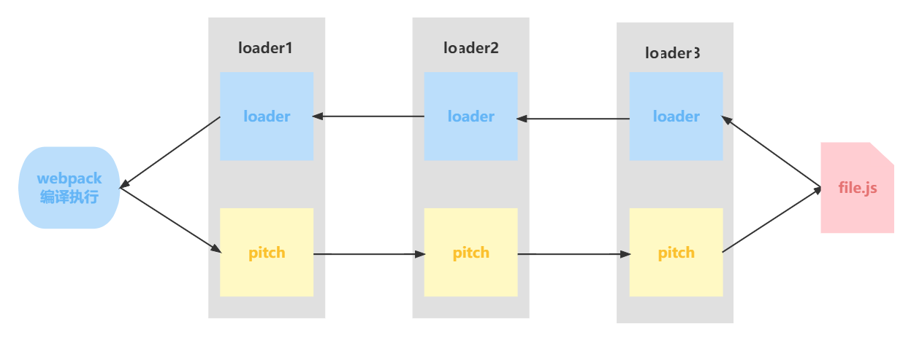
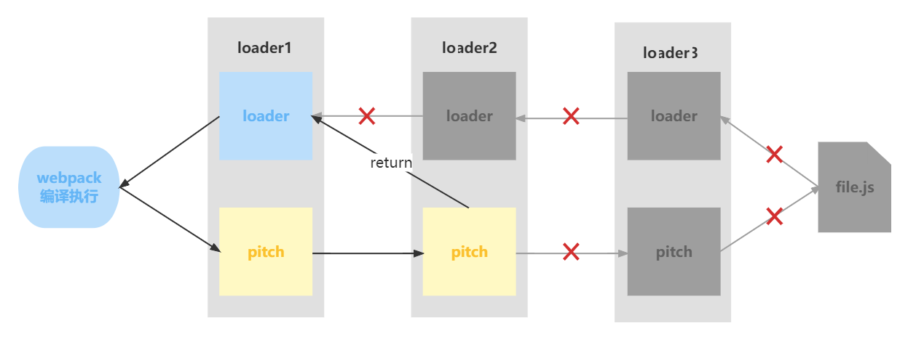

## 说明

> webpack5 基础使用、高级使用、配置优化、项目搭建、原理解析。附：[Webpack 官方文档](https://webpack.docschina.org/)

1. `npm run docs`，打开说明文档

2. `npm run dev`，webpack5 开发环境运行

3. `npm run build`，webpack5 生产环境打包

4. `npm run dev:react`，react-cli 开发环境运行

5. `npm run build:react`，react-cli 生产环境打包

6. `npm run dev:vue`，vue-cli 开发环境运行

7. `npm run build:vue`，vue-cli 生产环境打包

8. `npm run dev:origin`，loader + plugin 原理，开发环境运行

9. `npm run build:origin`，loader + plugin 原理，生产环境打包

10. `npm run debug`，loader + plugin 原理，可以在 chrome 浏览器上调试 webpack 的执行流程

11. `npm run compiler`，编译结果分析 + 模块化原理


12. 基础与初步理解
    - webpack 本身功能比较少，只能处理 js 文件（还有 json 也可以），处理其它文件需要对应的 loader
    - webpack 本身的一个重要功能就是，处理模块化问题，ES Module 和 Commonjs 都可以处理
    - 理解 webpack 打包过程中三个重要的概念：module、chunk、bundle
      - module：各个源码文件（js、css、png、svg ...）
      - chunk：多个模块合并而成的，在打包过程中出现，存在于内存中
      - bundle：最终的输出文件，chunk 会被输出成文件，这种文件被称之为 bundle，一个 chunk 对应一个 bundle 文件


13. 优化打包构建的几个角度
    - 提升开发体验
      - SourceMap（源代码映射）
        - 增强调试体验。生成打包后代码和源代码之间的行列映射
        - 开发模式用，生产模式可用，但商业项目，Map 文件不要放在浏览器端，小心被反编译，有安全问题，一般放服务器
    - 提升打包构建速度
      - HotModuleReplacement（HMR/热模块替换）
        - 在程序运行中，替换、添加或删除模块，而无需重新加载整个页面
        - 开发模式用
      - oneOf
        - why：打包时每个文件都会经过所有 loader 处理，虽然因为 test 正则的存在，实际并没有匹配上，但是都要过一遍，比较慢
        - what：只要匹配上一个 loader，剩下的就不匹配了
        - 开发模式和生产模式都可以用，需要时优化，否则可能会更慢
      - include/exclude
        - why：开发的代码中可能引用第三方库，是不需要使用 loader 处理的
        - 一般只用做 js 的配置，css 不需要，因为 css 一般不引用第三方库
        - 开发模式和生产模式都要用，基础配置
      - cache
        - why：每次打包时 js 文件都要经过 Eslint 检查 和 Babel 编译，速度比较慢
        - what：对 Eslint 检查 和 Babel 编译结果进行缓存，这样再次打包时只用打包修改过的部分，速度就会更快了
        - 开发模式和生产模式都可以用
      - thread
        - why：当项目越来越庞大时，打包速度越来越慢，想要继续提升打包速度，其实就是要提升 js 的打包速度，因为其他文件都比较少
          - 对 js 文件处理主要就是 eslint 、babel、Terser 三个工具，所以我们要提升它们的运行速度，可以开启多进程同时处理 js 文件
        - what：多进程打包：开启电脑的多个进程同时干一件事，速度更快
          - 需要注意：仅在特别耗时的操作中使用，因为每个进程启动就有大约为 600ms 左右开销
        - 开发模式和生产模式都可以用，不过开发模式不需要压缩代码（Terser）
    - 减少代码体积
      - Tree Shaking
        - 移除 JavaScript 中的没有使用上的代码，注意只适用于 es module 的静态引入
        - 生产模式自动启用，可以配合属性：sideEffects
      - @babel/plugin-transform-runtime
        - why：Babel 为编译的每个文件都插入了辅助代码，比如 _extend，使代码体积过大，可以将这些辅助代码作为一个独立模块，来避免重复引入
        - what：禁用了 Babel 自动对每个文件的 runtime 注入，而是引入 @babel/plugin-transform-runtime 并且使所有辅助代码从这里引用
          - 这个插件还有个功能：防止 babel-polyfill（core-js）注入造成全局污染。插件会自定义 polyfill 方法名，并在编译时使用
            - 此功能一般用于第三方库的开发，要使用此功能需要：
              - 安装 @babel/runtime-corejs3 作为生产依赖（注意：@babel/runtime、@babel/runtime-corejs2、@babel/runtime-corejs3 三者只能用其一）
              - 对 @babel/plugin-transform-runtime 插件做自定义配置：`{ corejs: 3 }`，具体使用可参考生产配置
          - 更多使用方法，可以参考 babel 的官方文档：https://babeljs.io/docs/babel-plugin-transform-runtime
        - 开发模式和生产模式都可以用，需要时优化
      - image-minimizer
        - 压缩图片，一般情况下不需要，现在图片一般不会放在本地，都是 CDN 链接，如果本地的静态图片比较多，可以考虑使用（本项目中没有提供示例，需要的话看文档）
          - 一般来讲公司都有 CMS（内容管理系统），图片 path 不变，在不同的环境匹配不同的域名即可
        - 主要使用插件：image-minimizer-webpack-plugin，通过安装不同的其他包，区分为两种模式：无损压缩和有损压缩（相关的包可能很难下载下来。。）
    - 优化代码运行性能
      - Code Split
        - why：打包代码时会将所有 js 文件打包到一个文件中，体积太大了
        - what：将打包生成的文件进行代码分割，生成多个 js 文件，并且按需加载
          - 实现上分成两个小部分，一个是 `import()` 动态引入的语法，另一个是对 `optimization.splitChunks` 的配置
          - 在 import 语法中有用到魔法注释，关于魔法注释，可以参考文档：https://webpack.docschina.org/api/module-methods/#magic-comments
        - 开发模式和生产模式都可以用，尤其是要用到生产模式，优化代码产出
      - Preload / Prefetch
        - why：做了代码分割，使用 import 动态导入语法来进行代码按需加载，但是加载速度还不够好，比如：用户点击按钮时才加载这个资源，如果资源体积很大，那么用户会感觉到明显卡顿效果，我们想在浏览器空闲时间，加载后续需要使用的资源。我们就需要用上 Preload 或 Prefetch 技术
        - what：
          - 两种方式
            - `Preload`：预加载，告诉浏览器立即加载资源
            - `Prefetch`：预获取，告诉浏览器在空闲时才开始加载资源
          - 共同点
            - 都只会加载资源，并不执行
            - 都有缓存
          - 不同点
            - Preload 加载优先级高，Prefetch 加载优先级低
            - Preload 只能加载当前页面需要使用的资源，Prefetch 可以加载当前页面资源，也可以加载下一个页面需要使用的资源
          - 总结
            - 当前页面优先级高的资源用 Preload 加载
            - 将来的页面需要使用的资源用 Prefetch 加载
          - 它们的兼容性较差，Preload 相对于 Prefetch 兼容性好一点，但现在应该也没多少人用上古浏览器了吧！
          - 使用后的效果是：可以让 webpack 输出 Resource Hint
            - 例如：动态加载文件 `import('./path/to/LoginModal.js')`，代码在构建时会生成 `<link rel="prefetch" href="login-modal-chunk.js">` 并追加到页面头部，指示浏览器在闲置时间预获取 login-modal-chunk.js 文件
          - 本示例用的是 @vue/preload-webpack-plugin 插件，其实 webpack5 已经内置了此功能（但似乎不能全局配置）
            - 注意：使用本插件会在打包的时候直接插入 link 标签到 html 模板中，但是 webpack 内置方法不会直接插，而是在代码运行的时候通过 js 控制插入
            - 可参考官方文档：https://webpack.docschina.org/guides/code-splitting/#prefetchingpreloading-modules
        - 开发模式和生产模式都可以用，主要是生产模式，可以提高页面响应速度
      - Network Cache
        - why：配合 hash 值的变化做浏览器缓存，优化页面加载速度，确保文件内容改变时，hash 值变化，文件内容未变时，hash 值不变
        - what：
          - 三种生成 hash 值的方式
            - fullhash（webpack4 是 hash，在 webpack5 中 hash 已弃用）
              - 每次修改任何一个文件，所有文件名的 hash 值都将改变。所以一旦修改了任何一个文件，整个项目的文件缓存都将失效
              - 注意这个 fullhash 只能用于 “编译层面” 的替换，不能用于输出的媒体文件名替换
              - 输出的媒体文件，例如图片、视频、字体等 bundle 文件中，文件名可以使用模块层面的 hash 做替换
                - 其实也可以使用 contenthash 做替换，但考虑到一般来说，媒体文件的内容是不会被修改的，不用考虑缓存问题，所以直接使用 hash 即可
              - 具体使用可以参考官方文档：https://webpack.docschina.org/configuration/output/#template-strings
            - chunkhash
              - 根据不同的入口文件(Entry)进行依赖文件解析、构建对应的 chunk，生成对应的哈希值。我们 js 和 css 是同一个引入，会共享一个 hash 值
            - contenthash
              - 根据文件内容生成 hash 值，只有文件内容变化了，hash 值才会变化。所有文件的 hash 值是独享且不同的
              - 适用于经常修改的文件
          - 对于我们经常修改的文件，使用 contenthash 可以保证文件在未修改时，其 hash 值不变，但是仍然存在问题：
            - 假如在我们生成的 bundle 文件中，A 文件依赖于 B 文件，B 文件对应的 module 做修改时，重新打包生成的 B 文件 hash 值会变化，这个正常，但是 A 文件的 hash 值也会变化，这是因为 A 文件依赖于 B 文件，B 文件的文件名发生了变化，所以在 A 文件中的 B 文件的引用也发生了变化，这就间接的导致了 A 文件的 hash 值也发生了变化，但是我们不希望 A 文件的 hash 发生变化，怎么办？
            - 解决方法就是：将 hash 值单独保管在一个 runtime 文件中
            - 我们最终输出三个文件：A、B、runtime。当 B 文件发生变化，变化的是 B 和 runtime 文件，A 不变
            - runtime 文件只保存文件的 hash 值和它们与文件的关系，整个文件体积就比较小，所以变化重新请求的代价也小，并且不影响页面
            - 只需要对 `optimization.runtimeChunk` 进行配置即可
        - 主要是生产模式使用，开发模式感觉用了也没啥用，开发环境主要使用热更新
      - Core-js
        - why：这个其实不是什么优化性能，而是必须要做的事。我们使用 babel 对 ES6 代码进行处理，它能将 ES6 语法进行编译转换，比如箭头函数、点点点运算符等。但是如果是 async 函数、promise 对象、数组的一些方法（includes）等，它没办法处理。也就是说 babel 只能处理 ES6 的新语法，而不能处理新的 API。所以此时我们编译后的 js 代码仍然存在兼容性问题，一旦遇到低版本浏览器就会直接报错
        - what：core-js 是专门用来做 ES6 以及以上 API 的 polyfill（补丁）
          - 配置自动按需引入，参见：`.babelrc.js` 文件
          - 要注意 package.json 文件中 browserslist 的配置，否则可能无法引入 polyfill 代码
      - PWA
        - why：开发 Web App 项目，项目一旦处于网络离线情况，就没法访问了，如果想给项目提供离线体验的话，就可用上 PWA
        - what：渐进式网络应用程序（progressive web application - PWA）：是一种可以提供类似于 native app（原生应用程序）体验的 Web App 的技术，最重要的是，在离线（offline）时应用程序能够继续运行离线功能（不可能完整的，没网你还想咋样！），内部通过 Service Worker 技术实现
        - how：参考官方文档：https://webpack.docschina.org/guides/progressive-web-application/
          - 添加 Workbox 插件（workbox-webpack-plugin）
          - 在入口文件注册 Service Worker
        - 用于生产模式，在断网时供用户使用离线功能


14. 构建流行框架的脚手架（非命令式）
     - React-Cli
       - 所在目录：react-cli
       - webpack 配置基本沿用之前的常规配置，相对来说，有以下改动：
         - 公共改动：
           - 引入 cross-env 设置环境变量
           - 使用 babel-loader 处理 jsx? 文件，使用预设：babel-preset-react-app
           - eslint 配置，使用 extends：eslint-config-react-app
           - 使用 resolve.extensions 自动补全
           - 去掉了多进程功能，需要时再加
           - 使用路由懒加载：React.lazy、React.Suspense
         - 开发模式改动：
           - 激活 js 热更新（HMR），需要插件：@pmmmwh/react-refresh-webpack-plugin
           - devServer 兜底 index.html 配置：historyApiFallback: true
         - 生产模式改动：
           - 引入 copy-webpack-plugin，复制静态资源
           - 使用 splitChunks 分割代码（antd、react、其它）
     - Vue-Cli
       - 所在目录：vue-cli
       - webpack 配置和 react-cli 的差不多，相对来说，有以下改动：
         - 公共改动：
           - 自动补全把 .jsx 换成 .vue，并去掉处理 .jsx 结尾文件的配置
           - 增加 vue-loader 和 VueLoaderPlugin 插件
           - 将 style-loader 替换为 vue-style-loader
           - babel-loader 使用预设：@vue/cli-plugin-babel/preset（这个是安装 @vue/cli-plugin-babel 包）
           - eslint 使用 vue 官方配置："plugin:vue/vue3-essential" 和 "eslint:recommended"
           - 删除 loader 匹配的 oneOf 功能，因为 vue-loader 不支持
           - 使用 DefinePlugin 增加几个环境变量，解决 vue 页面提示警告的问题
           - Element Plus 按需加载配置：unplugin-auto-import、unplugin-vue-components
           - 配置了路径别名：resolve.alias
         - 开发模式改动：
           - 删除 react 的 js 热更新（HMR）功能，vue-loader 自带 HMR 功能
         - 生产模式改动：
           - 使用 splitChunks 分割代码（element-plus、vue、其它）
       - 关于 vue-loader 的使用，参考官方文档：https://vue-loader.vuejs.org/


15. webpack 原理
    - loader 原理
      - what：帮助 webpack 将不同类型的文件转换为可识别的模块
      - loader 按执行顺序分类：
        - pre：前置 loader
        - normal：普通 loader
        - inline：内联 loader
        - post：后置 loader
      - 执行顺序：
        - 4 类 loader 的执行优先级为：pre > normal > inline > post
        - 相同优先级的 loader 执行顺序为：从右到左，从下到上
          ```js
          // 此时 loader 执行顺序：loader3 - loader2 - loader1
          module: {
            rules: [
              {
                test: /\.js$/,
                loader: "loader1",
              },
              {
                test: /\.js$/,
                loader: "loader2",
              },
              {
                test: /\.js$/,
                loader: "loader3",
              },
            ],
          },
          // 像这种可以匹配到多个 loader 的写法，一般不太常用，我们还是尽量使用 use 数组
          // 对于不同文件后缀的匹配不用考虑先后问题，因为只会匹配到一个 loader
          ```
          ```js
          // 此时 loader 执行顺序：loader1 - loader2 - loader3
          module: {
            rules: [
              {
                enforce: "pre",
                test: /\.js$/,
                loader: "loader1",
              },
              {
                // 没有 enforce 就是 normal
                test: /\.js$/,
                loader: "loader2",
              },
              {
                enforce: "post",
                test: /\.js$/,
                loader: "loader3",
              },
            ],
          },
          ```
      - 使用 loader 的方式
        - 配置方式：在 webpack.config.js 文件中指定 loader（pre、normal、post）
        - 内联方式：在每个 import 语句中显式指定 loader（inline）
      - 关于 inline loader
        - 用法：`import Styles from 'style-loader!css-loader?modules!./styles.css';`
          - 使用 `css-loader` 和 `style-loader` 处理 `styles.css` 文件
          - 通过 `!` 将资源中的 loader 分开（文件与 loader 也要用 `!` 隔开）
          - `?` 后面是 loader 的参数
        - inline loader 可以通过添加不同前缀，跳过其他类型 loader
          - `!` 跳过 normal loader
            - `import Styles from '!style-loader!css-loader?modules!./styles.css';`
          - `-!` 跳过 pre 和 normal loader
            - `import Styles from '-!style-loader!css-loader?modules!./styles.css';`
          - `!!` 跳过 pre、normal 和 post loader
            - `import Styles from '!!style-loader!css-loader?modules!./styles.css';`
      - loader 的本质
        - 是一个函数，当 webpack 解析资源时，会调用相应的 loader 去处理
        - 接收文件内容作为参数，再把处理后的内容返回出去
        - 接收的参数：
          - content：文件内容
          - map：SourceMap 相关
          - meta：别的 loader 传递过来的数据
      - loader 分类
        - 同步 loader：[sync-loader](./origins/loaders/sync-loader/index.js)
        - 异步 loader：[async-loader](./origins/loaders/async-loader/index.js)
        - Raw Loader：[raw-loader](./origins/loaders/raw-loader/index.js)
        - Pitching Loader：[pitching-loader](./origins/loaders/pitching-loader/p1.js)
          - webpack 会先从左到右执行 loader 链中的每个 loader 上的 pitch 方法（如果有），然后再从右到左执行 loader 链中的每个 loader 上的普通 loader 方法
            <br/>
          - 在这个过程中如果任何 pitch 有返回值，则 loader 链被阻断。webpack 会跳过后面所有的的 pitch 和 loader，直接进入上一个 loader
            <br/>
      - loader 常用 API（更多 API 可以查阅官方文档：https://webpack.docschina.org/api/loaders/#the-loader-context）
        - `const callback = this.async()`：异步回调 loader，返回 this.callback
        - `this.callback(err, content, sourceMap?, meta?)`：可以同步或者异步调用的并返回多个结果的函数
        - `this.getOptions(schema)`：获取 loader 的 options
        - `this.emitFile(name, content, sourceMap)`：产生一个文件
        - `this.utils.contextify(context, request)`：返回一个相对路径
        - `this.utils.absolutify(context, request)`：返回一个绝对路径
      - 自定义 loader
        - clean-log-loader
          - 作用：清理 js 代码中的 console.log
          - 代码：[clean-log-loader](./origins/loaders/clean-log-loader/index.js)
        - banner-loader
          - 作用：给文件添加顶部文本注释
          - 代码：[banner-loader](./origins/loaders/banner-loader/index.js)
        - babel-loader
          - 作用：编译 js 代码，将 ES6+ 语法编译成 ES5- 语法
          - 代码：[babel-loader](./origins/loaders/babel-loader/index.js)
        - file-loader
          - 作用：将文件原封不动输出出去（图片）
          - 代码：[file-loader](./origins/loaders/file-loader/index.js)
        - style-loader
          - 作用：动态创建 style 标签，插入 js 中的样式代码，使样式生效
          - 代码：[style-loader](./origins/loaders/style-loader/index.js)
    - plugin 原理
      - what：扩展 webpack，加入自定义的构建行为，使 webpack 可以执行更广泛的任务，拥有更强的构建能力
      - plugin 工作流
        > webpack 就像一条生产线，要经过一系列处理流程后才能将源文件转换成输出结果。 这条生产线上的每个处理流程的职责都是单一的，多个流程之间有存在依赖关系，只有完成当前处理后才能交给下一个流程去处理。 插件就像是一个插入到生产线中的一个功能，在特定的时机对生产线上的资源做处理。webpack 通过 Tapable 来组织这条复杂的生产线。 webpack 在运行过程中会广播事件，插件只需要监听它所关心的事件，就能加入到这条生产线中，去改变生产线的运作。 webpack 的事件流机制保证了插件的有序性，使得整个系统扩展性很好
          <br/> ——「深入浅出 Webpack」
        - 站在代码逻辑的角度就是：webpack 在编译代码过程中，会触发一系列 Tapable 钩子事件，插件所做的，就是找到相应的钩子，往上面挂上自己的任务，也就是注册事件，这样，当 webpack 构建的时候，插件注册的事件就会随着钩子的触发而执行了（类似于 React、Vue 生命周期对应的方法）
      - webpack 内部的钩子
        - 钩子是什么
          - 钩子的本质就是：事件。为了方便我们直接介入和控制编译过程，webpack 把编译过程中触发的各类关键事件封装成事件接口暴露了出来。这些接口被很形象地称做：hooks（钩子）。开发插件，离不开这些钩子
        - Tapable
          - Tapable 为 webpack 提供了统一的插件接口（钩子）类型定义，它是 webpack 的核心功能库。webpack 中目前有十种 hooks，在 Tapable 源码中可以看到，他们是：
            ```js
              // 源码地址：https://github.com/webpack/tapable/blob/master/lib/index.js
              exports.SyncHook = require("./SyncHook"); // 同步钩子
              exports.SyncBailHook = require("./SyncBailHook");
              exports.SyncWaterfallHook = require("./SyncWaterfallHook");
              exports.SyncLoopHook = require("./SyncLoopHook");
              exports.AsyncParallelHook = require("./AsyncParallelHook"); // 异步并行钩子
              exports.AsyncParallelBailHook = require("./AsyncParallelBailHook");
              exports.AsyncSeriesHook = require("./AsyncSeriesHook"); // 异步串行钩子
              exports.AsyncSeriesBailHook = require("./AsyncSeriesBailHook");
              exports.AsyncSeriesLoopHook = require("./AsyncSeriesLoopHook");
              exports.AsyncSeriesWaterfallHook = require("./AsyncSeriesWaterfallHook");
              exports.HookMap = require("./HookMap");
              exports.MultiHook = require("./MultiHook");
            ```
          - Tapable 还统一暴露了三个方法给插件，用于注入不同类型的自定义构建行为：
            - tap：可以注册同步钩子和异步钩子
            - tapAsync：以回调方式注册异步钩子
            - tapPromise：以 Promise 方式注册异步钩子
        - plugin 构建对象
          - Compiler
            - compiler 对象中保存着完整的 Webpack 环境配置，每次启动 webpack 构建时它都是一个独一无二，仅仅会创建一次的对象
            - 这个对象会在首次启动 Webpack 时创建，我们可以通过 compiler 对象访问到 Webapck 的主环境配置，比如 loader 、 plugin 等等配置信息
            - 主要属性如下：
              - `compiler.options`：可以访问本次启动 webpack 时候所有的配置文件，包括但不限于 loaders 、 entry 、 output 、 plugin 等等完整配置信息
              - `compiler.inputFileSystem`：和 compiler.outputFileSystem 可以进行文件操作，相当于 Nodejs 中 fs
              - `compiler.hooks`：可以注册 tapable 的不同种类 Hook，从而可以在 compiler 生命周期中植入不同的逻辑（自定义插件）
            - 由 compiler 暴露的钩子：
              - 查阅文档：https://webpack.docschina.org/api/compiler-hooks/
          - Compilation
            - compilation 对象代表一次资源的构建，compilation 实例能够访问所有的模块和它们的依赖
            - 一个 compilation 对象会对构建依赖图中所有模块，进行字面上的编译(literal compilation)。在编译阶段，模块会被加载(load)、封存(seal)、优化(optimize)、分块(chunk)、哈希(hash)和重新创建(restore)
            - 主要属性如下：
              - `compilation.modules`：可以访问所有模块，打包的每一个文件都是一个模块
              - `compilation.chunks`：chunk 即是多个 modules 组成而来的一个代码块。入口文件引入的资源组成一个 chunk，通过代码分割的模块又是另外的 chunk
              - `compilation.assets`：可以访问本次打包生成所有文件的结果
              - `compilation.hooks`：可以注册 tapable 的不同种类 Hook，用于在 compilation 编译模块阶段进行逻辑添加以及修改（自定义插件）
            - 由 compilation 暴露的钩子：
              - 查阅文档：https://webpack.docschina.org/api/compilation-hooks/
        - 生命周期示意图（Webpack 构建的大致流程）
          <br/>
        - 开发插件并调试
          - 代码：[test-webpack-plugin](./origins/plugins/test-webpack-plugin/index.js)（内有开发自定义插件时的一些说明，以及 Webpack 构建流程文字说明）
        - 自定义 plugin
          - banner-webpack-plugin
            - 作用：给打包输出的文件添加注释
            - 代码：[banner-webpack-plugin](./origins/plugins/banner-webpack-plugin/index.js)
            - 补充：这个文件里面还说了关于 clean: true 的一些坑，很重要！
          - clean-webpack-plugin
            - 作用：打包输出文件前，清空打包目录（可以解决上面插件提到的 clean: true 的问题）
            - 代码：[clean-webpack-plugin](./origins/plugins/clean-webpack-plugin/index.js)
          - analyze-webpack-plugin
            - 作用：分析 webpack 打包资源大小，并输出分析文件
            - 代码：[analyze-webpack-plugin](./origins/plugins/analyze-webpack-plugin/index.js)
          - inline-chunk-webpack-plugin
            - 作用：webpack 打包生成的某些文件太小了（例如：runtime-hash），额外发送请求性能不好，所以需要将其内联到 js 中，从而减少请求数量
            - 代码：[inline-chunk-webpack-plugin](./origins/plugins/inline-chunk-webpack-plugin/index.js)
            - 操作 html-webpack-plugin，可以查看：[官方文档](https://github.com/jantimon/html-webpack-plugin/?tab=readme-ov-file#afteremit-hook) ，往上翻有一个执行流程图，我们主要是根据这个图，选择对应的 hooks 在自定义的插件中操作 html-webpack-plugin，这些 hooks 是 html-webpack-plugin 插件提供的


16. webpack 编译结果分析
    - 首先使用命令行：`npm run compiler`，然后到 `./compiler/bundle` 文件夹下查看结果
    - 可以到 `./compiler/_main.explain.js` 文件内查看编译结果分析（里面的注释写的很详细哈）
      - webpack 自己实现了一套导入导出体系，它把你写的代码全部进行编译转换，然后修改成它自己的那一套导入导出模式
        - 所以，即使你在前端写 commonjs 的代码，webpack 也能识别并转换，它有自己的一套模块化规范
      - 至于 webpack 是怎么做代码转换的？
        - 大致流程就是 webpack 会先读文件，然后利用 ast 工具做语法分析，进行文件内容替换，最后把处理后的文件输出出来，具体执行流程后面再说


<br/>持续更新中。。
